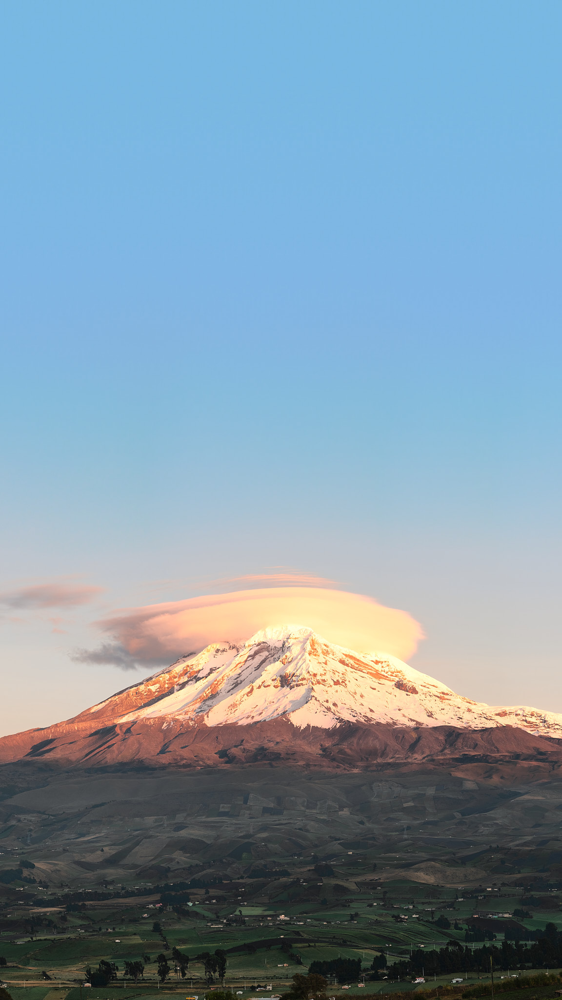

# Descubre Riobamba — Agencia de Turismo

Sitio web de una agencia de turismo ficticia especializada en el patrimonio, la
gastronomía y el turismo de montaña de Riobamba y la provincia de Chimborazo,
Ecuador.

## Datos del proyecto

| Campo | Detalle |
|---|---|
| **Estudiante** | Xavier Miguel Jiménez Albán |
| **Asignatura** | Diseño de Sitios Web |
| **Institución** | Universidad Técnica Estatal de Quevedo (UTEQ) |
| **Destino asignado** | Riobamba — Chimborazo |
| **Enfoque** | Patrimonio, gastronomía, naturaleza y turismo de montaña |

## Descripción

El sitio presenta a **Descubre Riobamba**, una agencia de turismo receptivo que
organiza recorridos por los principales atractivos de la provincia: el volcán
Chimborazo, El Altar, la laguna de Colta, el centro histórico, los talleres
artesanales de Guano y la gastronomía de mercado de la ciudad.

El proyecto consta de cinco páginas HTML enlazadas entre sí, una hoja de estilos
externa con diseño responsive y un conjunto de imágenes descargadas con licencia
libre.

## Tecnologías utilizadas

- **HTML5** — estructura semántica (`header`, `nav`, `main`, `section`,
  `article`, `footer`, `form`, `fieldset`)
- **CSS3** — variables personalizadas, Flexbox, CSS Grid, media queries,
  pseudo-clases (`:hover`, `:focus`), box model, `box-shadow`, `border-radius`,
  gradientes y transiciones
- **Google Fonts** — familias Fraunces e Inter
- **Git** — control de versiones
- **GitHub Pages** — publicación del sitio

## Estructura del proyecto

```
examen-final-turismo-riobamba/
├── index.html          ← Página de inicio
├── destinos.html       ← Lugares turísticos (8 atractivos)
├── servicios.html      ← Servicios y paquetes (6 programas)
├── nosotros.html       ← Historia, misión, visión y valores
├── contacto.html       ← Formulario de contacto y reserva
├── README.md
├── css/
│   └── styles.css      ← Hoja de estilos única
└── images/
    ├── logo.svg
    ├── hero.jpg
    ├── chimborazo.jpg
    ├── altar.jpg
    ├── vicuna.jpg
    ├── colta.jpg
    ├── balbanera.jpg
    ├── catedral.jpg
    ├── concepcion.jpg
    ├── parque-maldonado.jpg
    ├── estacion-tren.jpg
    ├── guano.jpg
    ├── hornado.jpg
    ├── ceviche-chochos.jpg
    └── riobamba-vista.jpg
```

## Captura del sitio



## Sitio publicado

🔗 **URL:** https://xavierjimenezalban.github.io/examen-final-turismo/

## Licencia de las imágenes

Todas las fotografías provienen de **Wikimedia Commons** y se distribuyen bajo
licencias Creative Commons. El logotipo es un SVG creado para el proyecto.
